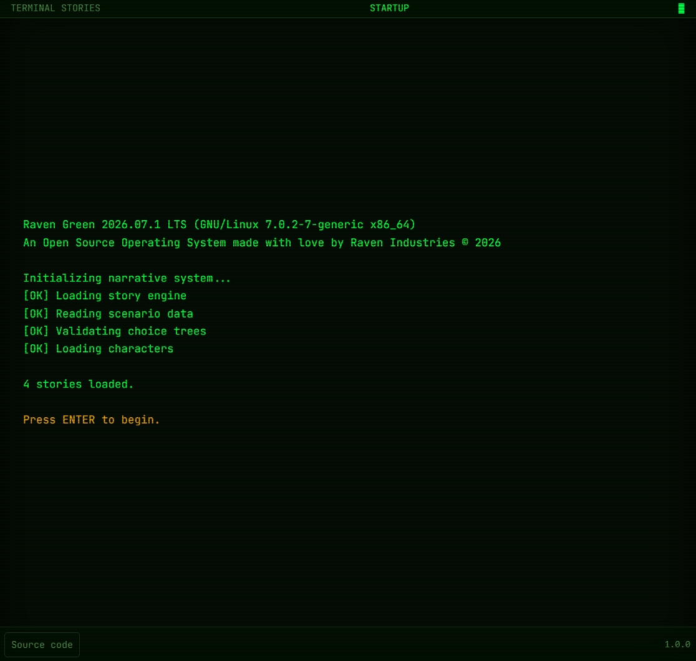

# 🎭 Terminal Stories

## In French

> [!IMPORTANT]
> Le code du projet est aussi hébergé sur mon instance GitLab personnalisée, accessible à [cette adresse](https://git.florian-dev.fr/floriantrayon/Terminal-Stories). Le dépôt GitHub est un miroir du dépôt GitLab, **mis à jour automatiquement**.
>
> **Les contributions publiques restent sur GitHub et sont les bienvenues** ; les pull requests validées y seront ensuite transférées manuellement sur GitLab pour être intégrées. 🙂

### Introduction

Après avoir réalisé un site Internet servant de page d'accueil vers mes différents projets et réseaux sociaux, appelé [Terminal Homepage](https://github.com/FlorianLeChat/Terminal-Homepage), j'ai souhaité concrétiser un projet plus ambitieux, qui allait nécessiter une bonne part de réflexion et de temps de développement. Avec l'avènement de l'intelligence artificielle, j'ai enfin eu l'opportunité de le créer à mon goût, avec un temps de développement bien plus réduit que ce que j'avais estimé si je l'avais fait seul. Je vous présente **Terminal Stories**. ❤️

Terminal Stories, qu'est-ce que c'est ? C'est un lecteur d'histoires interactives qui reprend les codes et l'esthétique des terminaux informatiques d'une époque passée. Il vous permet de lire, découvrir et interagir avec des histoires, des récits et des textes de fiction. Ces histoires peuvent être préenregistrées, mais aussi générées entièrement à la volée par une intelligence artificielle. 🧠

En plus de leurs fonctionnalités de choix et d'interaction, les histoires interactives s'accompagnent de plusieurs autres fonctionnalités : la sauvegarde et la reprise des histoires en cours, ainsi que l'accès à une encyclopédie de l'univers, des personnages et des lieux. Le tout est bien sûr gratuit et collaboratif : vos propres histoires peuvent être soumises pour être intégrées au site en ouvrant un ticket sur le [dépôt GitHub](https://github.com/FlorianLeChat/Terminal-Stories). 😉

Concernant la partie technique, le site respecte des valeurs de sobriété numérique, d'accessibilité et de respect de la vie privée. Construit une fois puis hébergé statiquement sur [GitLab Pages](https://docs.gitlab.com/user/project/pages/), il limite ainsi son empreinte carbone. Il s'appuie sur des technologies Web modernes telles que [SvelteKit](https://svelte.dev/docs/kit/introduction) ❤️‍🔥, [Vite](https://vite.dev/), [TailwindCSS](https://tailwindcss.com/) et [TypeScript](https://www.typescriptlang.org/), et ne contient ni cookies, ni publicité. Aucune technologie de suivi n'est utilisée par défaut ; le site peut toutefois activer, optionnellement, une mesure d'audience via [Umami](https://umami.is/) (si activé), une alternative open source et respectueuse de la vie privée à Google Analytics : sans cookies, sans collecte de données personnelles identifiables, et conforme au RGPD. Il est entièrement accessible à tous, sans restriction. Sur le plan de l'accessibilité, le site est complètement navigable au clavier, compatible avec les lecteurs d'écran, et un effort particulier a été porté sur la navigation depuis les appareils mobiles. 🌱

### Installation

> [!WARNING]
> Le déploiement en environnement de production nécessite un serveur Web déjà configuré comme [Nginx](https://nginx.org/en/), [Apache](https://httpd.apache.org/) ou [Caddy](https://caddyserver.com/) pour servir les fichiers statiques générés par Vite. ⚠️

#### Développement local

- Installer [Node.js LTS](https://nodejs.org/) (>22 ou plus) ;
- Installer les dépendances du projet avec la commande `npm install` ;
- Démarrer le serveur local Vite avec la commande `npm run dev`.

#### Déploiement en production

- Installer [Node.js LTS](https://nodejs.org/) (>22 ou plus) ;
- Installer les dépendances du projet avec la commande `npm install` ;
- Compiler les fichiers statiques du site Internet avec la commande `npm run build` ;
- Utiliser un serveur Web pour servir les fichiers statiques générés à l'étape précédente.

## In English

> [!IMPORTANT]
> The project's code is also hosted on my custom GitLab instance, available at [this address](https://git.florian-dev.fr/floriantrayon/Terminal-Stories). The GitHub repository is a mirror of the GitLab repository, **automatically kept up to date**.
>
> **Public contributions remain on GitHub and are welcome**; validated pull requests will then be manually transferred to GitLab to be integrated. 🙂

### Introduction

After creating a website called [Terminal Homepage](https://github.com/FlorianLeChat/Terminal-Homepage), which serves as a home page for my personal projects and social media accounts. I decided to take on a more ambitious project—one that would require a lot of thinking and development time. But with the rise of artificial intelligence, I finally had the opportunity to create it exactly as I wanted, with a much shorter development time than I would have needed if I'd done it alone. Introducing Terminal Stories. ❤️

What is Terminal Stories? It's an interactive story reader based on the design and aesthetics of computer terminals from a past era. It lets you read, discover, and interact with stories, narratives, and works of fiction. These stories can be pre-recorded, but they can also be generated entirely on the fly by artificial intelligence. 🧠

As well as their choice-and-interaction features, the interactive stories come with several other features: you can save and resume stories in progress, and access an encyclopedia of the universe, characters, and locations. It's all free and collaborative, of course: you can submit your own stories to be added to the website by opening a ticket on the [GitHub repository](https://github.com/FlorianLeChat/Terminal-Stories). 😉

In terms of technical aspects, the website reflects values of digital sobriety, accessibility, and respect for privacy. Built once and then statically hosted on [GitLab Pages](https://docs.gitlab.com/user/project/pages/), it minimizes its carbon footprint. It relies on modern web technologies such as [SvelteKit](https://svelte.dev/docs/kit/introduction) ❤️‍🔥, [Vite](https://vite.dev/), [TailwindCSS](https://tailwindcss.com/), and [TypeScript](https://www.typescriptlang.org/), and contains no cookies or advertisements. No tracking technology is used by default; the site can optionally enable audience measurement through [Umami](https://umami.is/) (if enabled), an open-source, privacy-friendly alternative to Google Analytics: no cookies, no collection of personally identifiable data, and GDPR-compliant. It is fully accessible to everyone, without restriction. From an accessibility perspective, the website is fully keyboard-navigable, compatible with screen readers, and special attention has been given to navigation on mobile devices. 🌱

### Setup

> [!WARNING]
> Deployment in a production environment requires a pre-configured web server such as [Nginx](https://nginx.org/en/), [Apache](https://httpd.apache.org/), or [Caddy](https://caddyserver.com/) to serve the static files generated by Vite. ⚠️

#### Local development

- Install [Node.js LTS](https://nodejs.org/) (>22 or higher) ;
- Install project dependencies using `npm install` ;
- Start Vite local server using `npm run dev`.

#### Production deployment

- Install [Node.js LTS](https://nodejs.org/) (>22 or higher) ;
- Install project dependencies using `npm install` ;
- Build static website files using `npm run build` ;
- Remove development dependencies using `npm prune --omit=dev` ;
- Use a web server to serve the static files generated in the previous step.

